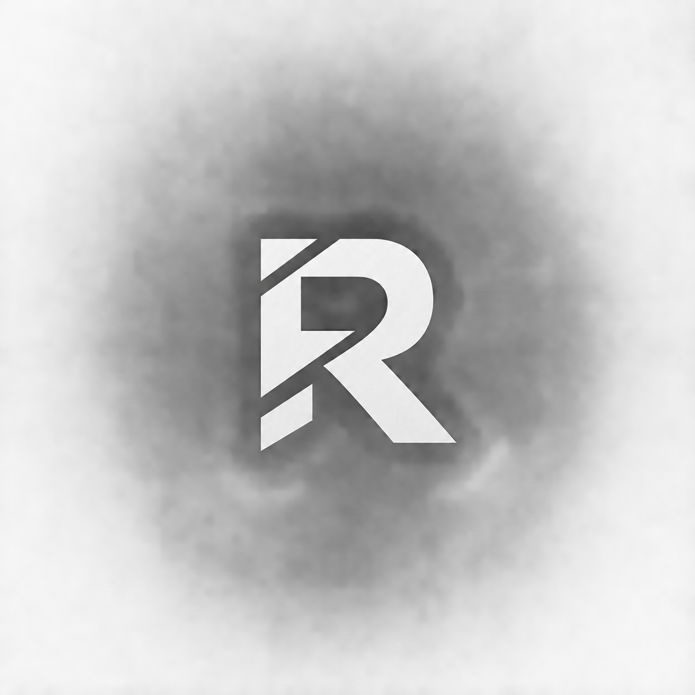

<div align="center">
  
  <br />
  <br />

  <h1>Rushank | ECE & Embedded Systems Portfolio</h1>
  <p>
     Interactive Awwwards-style engineering portfolio showcasing embedded systems, IoT telemetry, and digital design projects.
  </p>


  <p>
    <a href="#about">About</a> •
    <a href="#features">Features</a> •
    <a href="#tech">Technologies</a> •
    <a href="#projects">Projects</a> •
    <a href="#running-locally">Running Locally</a>
  </p>
</div>

---

## 📋 About

Personal portfolio of **Rushank**, an Electronics & Communication Engineering (ECE) student at VTU (BLDEA's CET) and **IoT Engineer Intern at AIoT Hub, Gujarat**. Built with Next.js 16 (Turbopack), React 19, Framer Motion physics-based interactions, and Lenis smooth scrolling.

## ✨ Features

- **Physics-Based Hanging Profile Widget**: Interactive swing physics with direct mouse drag controls.
- **Dual-Track Hero Image Slider**: Seamless infinite scroll ticker presenting portrait photography.
- **Smooth Scroll**: Native-feeling inertial scroll experience powered by Lenis.
- **Dynamic Dark/Light Themes**: Accessible theme switcher with fluid contrast transitions.
- **Featured Embedded & CV Projects**: Interactive modals with GitHub repositories and technical specifications.

## 🛠️ Technologies

- **Frontend / Framework**: Next.js 16 (Turbopack), React 19, TypeScript, Tailwind CSS v4, Framer Motion, Radix UI.
- **Engineering Stack**: ESP-IDF v5.4, FreeRTOS, Embedded C/C++, Python, Django, Arduino, LittleFS, MQTT, OpenCV.

## 🚀 Running Locally

```bash
# Install dependencies
npm install

# Start development server
npm run dev

# Build production bundle
npm run build
```

Open [http://localhost:3000](http://localhost:3000) to view the portfolio.

---

<p align="center">
  <sub>© 2026 Rushank. All rights reserved.</sub>
</p>